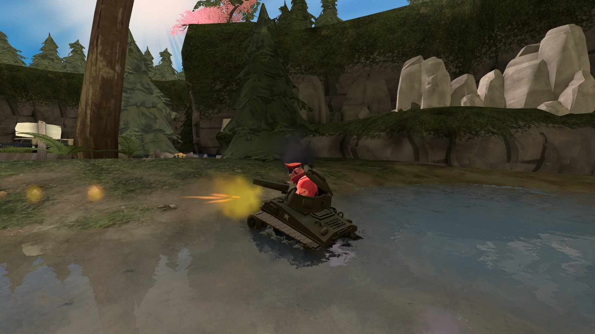
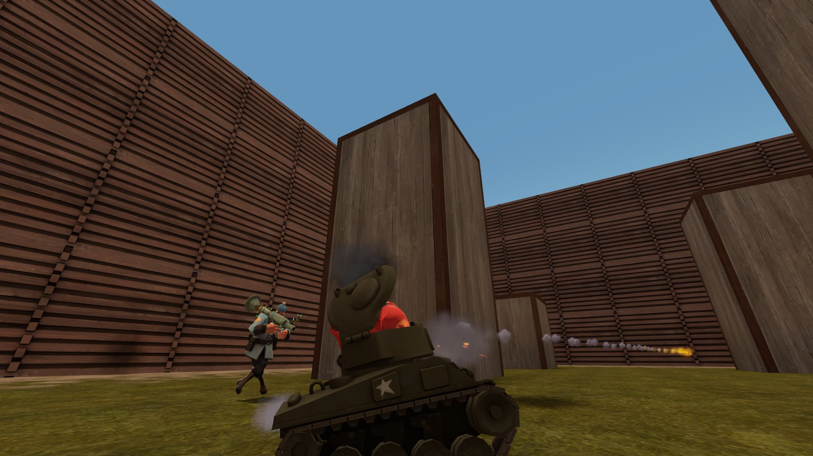

# TF2 Panzer Taunt Rockets

This is a Sourcemod plugin that allows soldiers using the Panzer Pants taunt to aim and fire a rocket from the cannon.

Plugin thread: https://forums.alliedmods.net/showthread.php?t=311570

 
